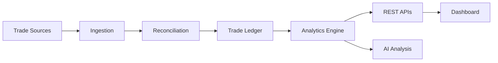

 

# Arup Mahato

### Java Backend Engineer

`Java` · `Spring Boot` · `Microservices` · `REST APIs`

Building production-grade backend systems with a focus on 
**security, payments, data consistency and performance.**

 

 

<table>
  <tr>
    <td align="center" width="170"><h2>3+</h2>YEARS IN BACKEND ENGINEERING</td>
    <td align="center" width="170"><h2>10+</h2>SPRING BOOT MICROSERVICES</td>
    <td align="center" width="170"><h2>100+</h2>REST ENDPOINTS IN PRODUCTION</td>
    <td align="center" width="170"><h2>500+</h2>ACTIVE USERS ON A CMS I BUILT FOR</td>
  </tr>
</table>

 

## What I Build

<table>
  <tr>
    <td width="50%" valign="top">⚙️ <b>Backend Systems</b> Spring Boot microservices with clean REST contracts and layered design.</td>
    <td width="50%" valign="top">🔐 <b>Authentication & Security</b> Spring Security with JWT authentication and role-based access control.</td>
  </tr>
  <tr>
    <td valign="top">💳 <b>Payment Integrations</b> Gateway flows with idempotency keys and webhook reconciliation.</td>
    <td valign="top">🗄️ <b>Database Engineering</b> Schema design, composite indexes and fixing N+1 queries in JPA.</td>
  </tr>
  <tr>
    <td valign="top">⚡ <b>Performance & Caching</b> Redis caching for hot data and query-level optimization.</td>
    <td valign="top">🔄 <b>Concurrency & Consistency</b> Transactions and locking that hold up under simultaneous writes.</td>
  </tr>
</table>

 

## Tech Stack

**Architecture** &nbsp; Microservices · REST APIs · Layered Architecture · SOLID 
**Testing** &nbsp; JUnit 5 · Mockito 
**Tools** &nbsp; Git · Maven · Postman · Swagger/OpenAPI · Linux 
**Learning** &nbsp; Kafka · Distributed Systems · System Design · Cloud · CI/CD &nbsp;<i>(currently deepening)</i>

 

## Experience

### Togethring Media Labs
**Backend Development Engineer** &nbsp; `Dec 2024 – Present · Pune`

- Designed and delivered **10+ Spring Boot microservices** in production, each independently deployable
- Built and secured **100+ REST endpoints** with Spring Security, JWT and role-based authorization
- Integrated **payment gateways** with **idempotency keys** and **webhook reconciliation** to prevent duplicate charges
- Resolved **N+1 queries**, added **composite indexes** and introduced **Redis caching** on high-traffic reads

### Heliverse Technologies
**Java Backend Developer** &nbsp; `Jun 2023 – Sep 2024 · Gurugram`

- Built a **real-time property bidding system** using transactions and locking to stay consistent under **concurrent bids**
- Developed REST APIs for a Customer Management System serving **500+ active users**
- Implemented **payment gateway integration** and **RBAC** across core modules

 

# 🚀 TradeDrift

### Trading Journal & Backtesting Platform

**Backend Engineer · Personal Project** &nbsp;·&nbsp; [tradedrift.in](https://tradedrift.in)

Traders import their history from CSV files or broker sync. TradeDrift reconciles raw fills into a clean trade ledger and runs a deterministic analytics engine on top, so the same trades always produce the same numbers.

<table>
  <tr>
    <td width="50%" valign="top"><b>Reconciliation</b> Raw fills rebuilt into normalized trades with fees and funding costs.</td>
    <td width="50%" valign="top"><b>Deterministic Analytics</b> Win rate, expectancy, profit factor and drawdown, reproducible every run.</td>
  </tr>
  <tr>
    <td valign="top"><b>Multi-Tenancy</b> Every read and write scoped to its tenant.</td>
    <td valign="top"><b>Auth & Billing</b> JWT authentication and subscription billing across pricing tiers.</td>
  </tr>
</table>

<b>Stack:</b> Java · Spring Boot · PostgreSQL · REST APIs · JWT

<!--
FEATURED REPOSITORIES: uncomment once a showcase repo is public.

 

## Featured Repositories

- **[REPO_NAME](https://github.com/arupmahato03/REPO_NAME)** — one line on the backend problem it solves
-->

 

---

**Open to backend engineering conversations**

[LinkedIn](https://www.linkedin.com/in/arup-mahato/) · [Portfolio](https://arupmahato03.github.io/) · [Email](mailto:arup71062@gmail.com) · [TradeDrift](https://tradedrift.in)

