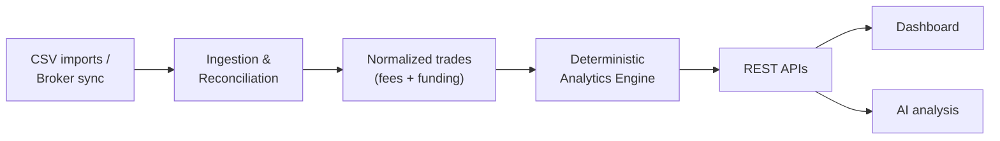

# Arup Mahato

### Java Backend Engineer

Building production backend systems with Java, Spring Boot, REST APIs and microservices, 
with a focus on security, payments, data consistency and database performance.

---

I'm a Java Backend Engineer with 3+ years of experience building and maintaining Spring Boot services in production. I'm currently at **Togethring Media Labs** and was previously at **Heliverse Technologies**.

Most of my work is on the server side of products: designing and securing REST APIs, integrating payments safely, and keeping the database layer fast and consistent under concurrent load.

---

## What I Work On

| Area | In practice |
|:--|:--|
| **API design** | 10+ Spring Boot microservices and 100+ REST endpoints in production |
| **Security** | Spring Security with JWT authentication and role-based authorization |
| **Payments** | Gateway integrations using idempotency keys and webhook reconciliation to prevent duplicate charges |
| **Database performance** | Resolving Hibernate/JPA N+1 queries, composite indexes, MySQL schema tuning |
| **Caching** | Redis for frequently accessed data |
| **Concurrency** | Transactions and locking strategies to keep a real-time bidding system consistent under simultaneous bids |
| **Integrations** | Third-party REST APIs, webhooks, CRM data sync, Wix plugin services |
| **Analytics** | Event aggregation and reporting APIs for internal dashboards |

---

## Tech Stack

| Area | Stack |
|:--|:--|
| **Languages** | Java (8 / 11 / 17), SQL |
| **Core Java** | OOP, Collections, Generics, Multithreading, Streams, Exception Handling |
| **Backend** | Spring Boot, Spring MVC, Spring Data JPA, Spring Security, Spring AOP, Hibernate |
| **Architecture** | Microservices, REST API design, Layered architecture, SOLID |
| **Data** | PostgreSQL, MySQL, MongoDB, Redis, indexing, schema design, transaction management |
| **Security** | JWT, OAuth 2.0, RBAC |
| **Testing** | JUnit 5, Mockito |
| **Tools** | Git, Maven, Docker, Postman, Swagger / OpenAPI, IntelliJ IDEA, Linux |

---

## Experience

### Backend Development Engineer · Togethring Media Labs
`Dec 2024 – Present` · Pune, India

- Designed and delivered **10+ Spring Boot microservices** in production, each independently deployable with its own REST contract.
- Built and secured **100+ REST endpoints** using Spring Security, JWT authentication and role-based authorization.
- Integrated **payment gateway flows** (100+ transactions / month) using idempotency keys and webhook reconciliation to prevent duplicate charges and payment mismatches.
- Improved the data layer by resolving **N+1 queries** in Hibernate/JPA, adding **composite indexes** in MySQL, and introducing **Redis caching** for frequently read data.

More

 

- Developed backend services for an analytics platform, aggregating event data and exposing reporting APIs for internal dashboards.
- Built Wix plugin services and CRM integration layers for third-party data synchronization.

### Java Backend Developer · Heliverse Technologies
`Jun 2023 – Sep 2024` · Gurugram, India

- Engineered a **real-time property bidding system**, using database transactions and locking strategies to maintain data consistency under simultaneous bids.
- Developed Spring Boot REST APIs for a **Customer Management System** serving 500+ active users.
- Implemented payment gateway integration and **role-based access control** across core modules.

---

## TradeDrift

**Trading journal & backtesting platform** · *Backend Engineer | Personal Project*

Traders bring in their trade history from CSV files or broker sync. TradeDrift reconciles it into a clean, normalized ledger and computes performance analytics they can rely on.

| Problem | Approach |
|:--|:--|
| **Messy source data** | Ingestion and reconciliation pipelines for CSV imports and broker sync; raw fills rebuilt into normalized trades including fees and funding costs |
| **Numbers users can trust** | Deterministic analytics engine: the same trades always produce the same win rate, expectancy, profit factor and drawdown |
| **Tenant isolation** | Multi-tenant data isolation, with every read and write scoped to its tenant |
| **Authentication** | JWT-based authentication |
| **Billing** | Subscription billing across multiple pricing tiers |
| **AI-ready data** | Analytics stored in a structured form for downstream AI analysis |

**Stack:** Java · Spring Boot · PostgreSQL · REST APIs · JWT

<!--
=========================================================
FEATURED REPOSITORIES — uncomment once a showcase repo is public.
Replace REPO_NAME and the description with real details only.
=========================================================

---

## Featured Repositories

| Repository | What it demonstrates |
|:--|:--|
| [REPO_NAME](https://github.com/arupmahato03/REPO_NAME) | One line on the backend problem it solves |

-->

---

## Currently Deepening

These are areas I'm actively studying and building with. I don't claim production experience in them yet.

`Apache Kafka` · `Distributed Systems` · `System Design` · `Scalable Backend Architecture` · `Cloud (AWS / Oracle Cloud)` · `CI/CD` · `Docker in production deployments`

---

**Open to backend engineering conversations.**

[LinkedIn](https://www.linkedin.com/in/arup-mahato/) · [Portfolio](https://arupmahato03.github.io/) · [arup71062@gmail.com](mailto:arup71062@gmail.com) · [TradeDrift](https://tradedrift.in)

